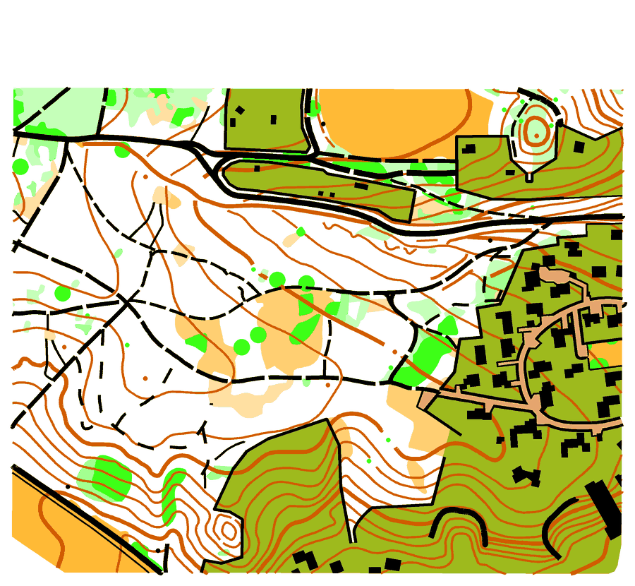
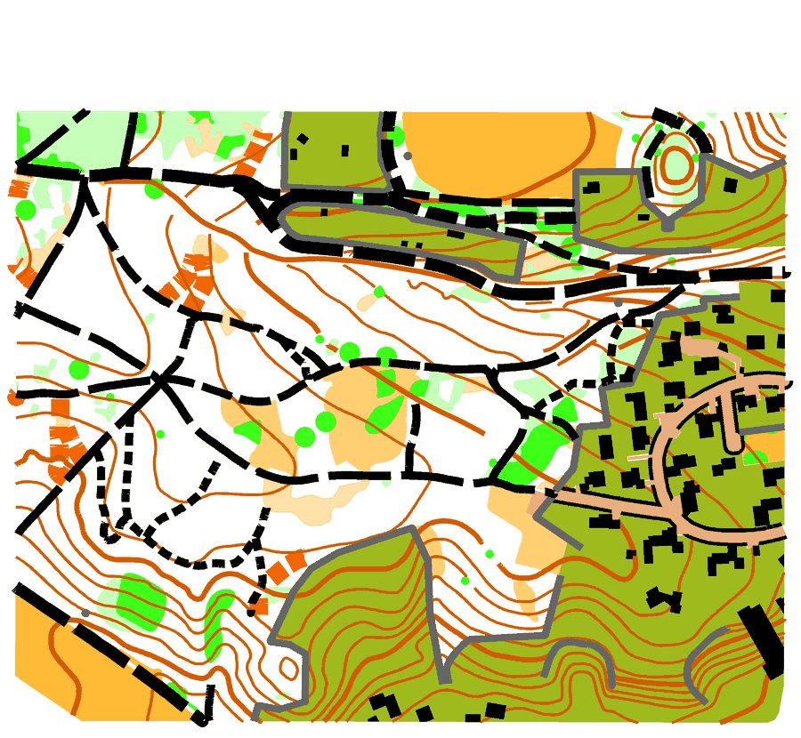
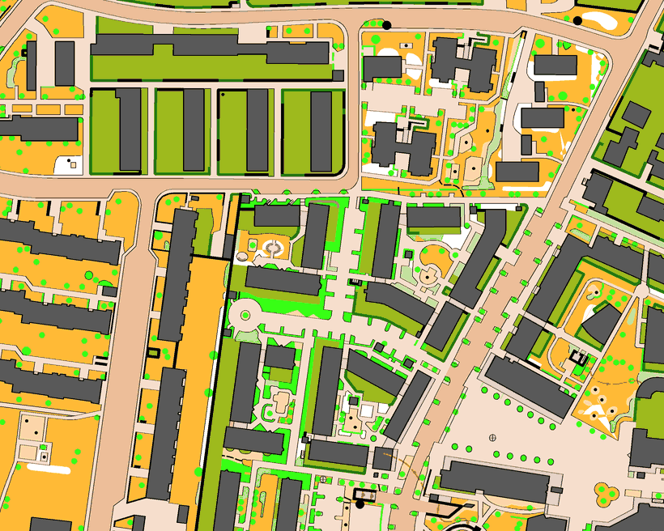
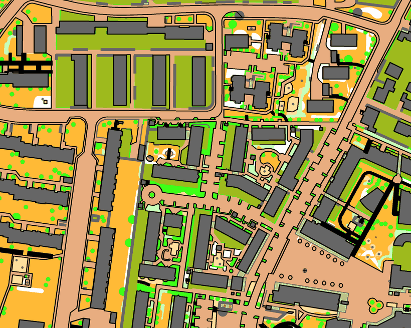
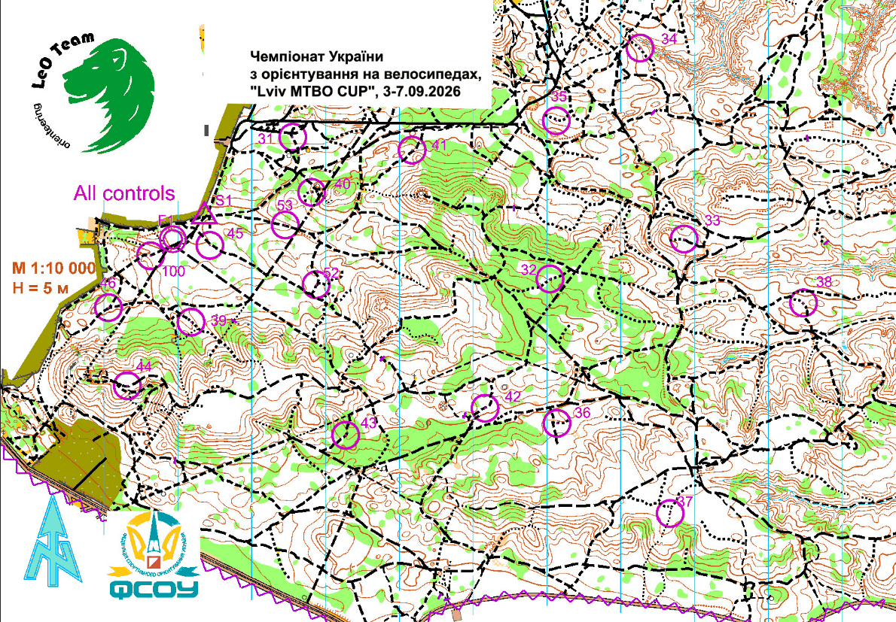
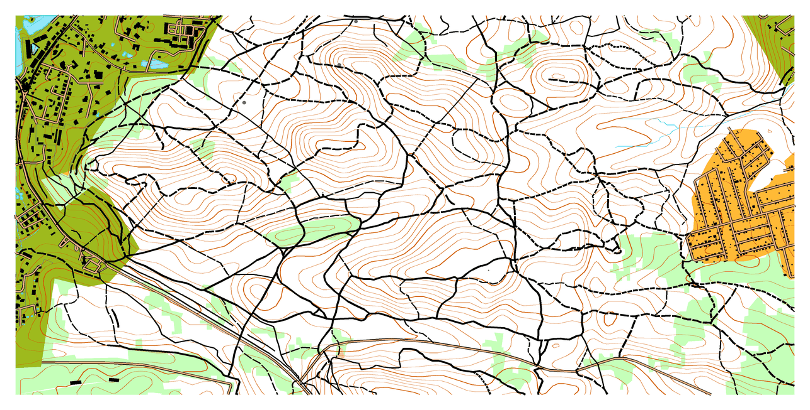
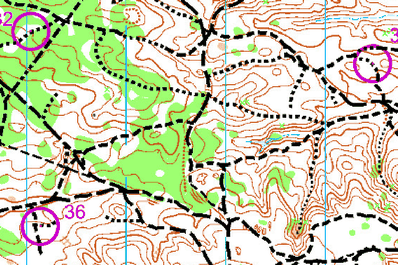
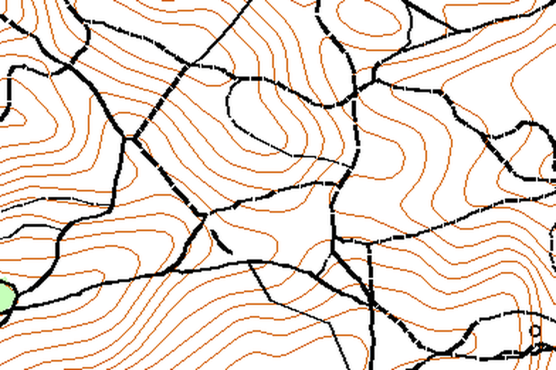

# Mapping skills

Claude Code skills for orienteering cartography.

| Skill | |
|---|---|
| [`mtbo-map-conversion`](#mtbo-map-conversion) | Convert an existing foot-orienteering map (ISOM / ISSprOM) into an MTBO map |
| [`mtbo-base-map`](#mtbo-base-map) | Build an MTBO base map from open data — OSM, Copernicus DEM, Sentinel-2, Strava heatmap, and your own GPS tracks for measured riding speed |

## `mtbo-map-conversion`

Converts a foot-orienteering map into a mountain bike orienteering map
(**ISMTBOM 2022**).

> **Format: OpenOrienteering Mapper only.** The skill reads and writes `.omap` (and
> its verbose twin `.xmap`), the native XML format of
> [OpenOrienteering Mapper](https://github.com/OpenOrienteering/mapper). It does
> **not** handle OCAD `.ocd`, Purple Pen, or PDF/image maps — open those in Mapper
> and save as `.omap` first. A map exported to `.omap` from OCAD works fine.

Handles:

- **ISOM 2000** and **ISOM 2017-2** forest sources → MTBO **1:15 000**
- **ISSprOM 2019** sprint sources (including OCAD exports) → MTBO sprint **1:5 000**

The conversion is a symbol-set replacement plus an object remap: it rebuilds the
colour table, renumbers and reorders symbols to ISMTBOM 2022, reclassifies the path
network by riding speed, and rescales coordinates and symbol dimensions.

### Install

Clone into a project so the skill lands in `.claude/skills/`:

```bash
git clone https://github.com/wpionua/Mapping-skiils.git
cp -r Mapping-skiils/.claude/skills/mtbo-map-conversion /path/to/project/.claude/skills/
```

Or copy it to `~/.claude/skills/mtbo-map-conversion` to make it available everywhere.

Then ask Claude Code to convert a map, or invoke it directly with
`/mtbo-map-conversion`.

### Examples

#### Forest — ISOM 2000 at 1:10 000 → ISMTBOM 2022 at 1:15 000

| Before | After |
|---|---|
|  |  |

The path network is the whole story: undifferentiated ISOM paths become tracks and
paths **classified by riding speed**, so dash pattern now tells you how fast a route
is. Narrow rides turn orange (830, "permitted to ride"), and the high fence and cliff
shift from black to **black 60 %** — the grey lines — as ISMTBOM requires. Cultivation
and vegetation boundaries are gone: §4.6 requires omitting them because they read as
track symbols. 539 objects in, 473 out.

#### Sprint — ISSprOM 2019 at 1:4 000 → ISMTBOM 2022 sprint at 1:5 000

Detail of about 360 × 290 m:

| Before | After |
|---|---|
|  |  |

Paved areas move to a stronger brown 50 %, and buildings pick up the **black 60 %
fill with a black outline** that ISMTBOM specifies at 1:5 000 and 1:7 500 only. The
whole ISSprOM symbol set is replaced — the output uses ISMTBOM 2022 symbols and
nothing else.

> These previews are drawn by [`docs/render_preview.py`](docs/render_preview.py), a
> small rasteriser included here so the images are reproducible. Mapper 0.9.x has no
> headless export, so they are **not** Mapper's own rendering: area patterns, point
> symbol shapes and text are approximated or omitted. Open the files in Mapper for
> the real thing.

### Contents

| Path | |
|---|---|
| `SKILL.md` | Workflow: format choice, source-spec detection, the decisions that must come from the surveyor, traps, validation checklist |
| `reference/mapping.md` | ISOM 2000 → ISMTBOM 2022 and ISSprOM 2019 → ISMTBOM 2022 symbol tables, rideability ladders, scale-dependent colours |
| `scripts/convert.py` | Forest converter template (1:15 000) |
| `scripts/convert_sprint.py` | Sprint converter template (1:5 000) |

Both scripts are templates: set the three paths at the top, then review `OBJ_MAP`.

### What it will not decide for you

**Rideability is not in the source data.** ISOM records a path's width and
distinctness; ISMTBOM records how fast you can ride it. Any mapping between the two
is a starting point that has to be ridden and corrected in the field. The skill
offers several ladders and states plainly that the result is unsurveyed.

### External dependency

The converters take symbol geometry from the official OpenOrienteering Mapper
symbol set, downloaded at runtime:

```
symbol sets/15000/ISMTBOM_15000.omap
```

That file is part of [OpenOrienteering Mapper](https://github.com/OpenOrienteering/mapper)
and is **GPLv3**; the `symbol sets/` directory carries no separate licence. Its
geometry ends up in the converted map file. Fine for a map you use yourself — check
the licence position before anything commercial or redistributed.

Note that the Mapper set is the **pre-2022** ISMTBOM (ISOM numbering plus 831–838
rideability codes); Mapper has not shipped an ISMTBOM 2022 set
([issue #1107](https://github.com/OpenOrienteering/mapper/issues/1107)). The skill
renumbers and recolours it to 2022.

### Specification

Symbol definitions, dimensions and colours follow **ISMTBOM 2022** (IOF Map
Commission), published at
<https://omapwiki.orienteering.sport/specifications/ismtbom/>. The specification
itself is licensed CC BY-ND 4.0 and is not reproduced here in full — see the IOF
publication for the authoritative text and drawings.

## `mtbo-base-map`

Builds a **base MTBO map (ISMTBOM 2022) from open data** — no source map needed:

| Layer | Source |
|---|---|
| Tracks, paths, roads, water, buildings, fences, towers | **OpenStreetMap** (Overpass) |
| Riding-speed classes 502/502.1/815–822 | inferred from `tracktype`, `surface`, `smoothness` |
| …**measured** instead, where you have ridden it | a folder of **GPS tracks** (`.gpx`): flat-equivalent speed at a reference power |
| Contours 101/102, 5 m interval | **Copernicus DEM GLO-30** |
| Vegetation 406/401/308 | **ESA WorldCover 10 m** refined with **multi-date Sentinel-2** NDVI |
| Confirmation and extension of the ride network | **Strava global heatmap** screenshot (optional) |

Output is an `.omap` restricted to ISMTBOM 2022 symbols: the donor symbol set is
filtered to the codes the specification defines (121 of 185 for the set used here),
and objects that would have landed on an ISOM leftover are moved onto their ISMTBOM
equivalent instead of being dropped.

### Install

```bash
git clone https://github.com/wpionua/Mapping-skiils.git
cp -r Mapping-skiils/.claude/skills/mtbo-base-map /path/to/project/.claude/skills/
```

### Pipeline

```bash
S=".claude/skills/mtbo-base-map/scripts/mtbo_base.py"
python $S init --lat 49.8993 --lon 23.9866 --heatmap data/heatmap.png --scalebar-m 100 \
               --donor "ISMTBOM2022_15000.omap" --out "MTBO_area_15000.omap" \
               --tracks-dir "D:/rides"      # optional: your GPS track archive
python $S fetch        # OpenStreetMap
python $S heatmap      # Strava screenshot -> centre lines   (optional)
python $S contours     # Copernicus DEM    -> 5 m contours
python $S imagery      # Sentinel-2, several dates, merged
python $S vegetation   # WorldCover + seasonal NDVI -> 406/401/308
python $S speed        # GPS tracks -> measured 815-822        (optional)
python $S build        # -> the .omap + report + review images
python $S render       # -> preview
```

Each step records its state in `project.json` and can be re-run on its own.

### Example — Bryukhovychi Forest, Lviv

| Surveyed competition map | Generated from open data |
|---|---|
|  |  |

Left: a real surveyed MTBO map — Чемпіонат України з орієнтування на велосипедах,
"Lviv MTBO CUP", 3–7.09.2026, 1:10 000, H = 5 m, by LeO Team / ФСОУ, published at
<https://event-o.tech>. Right: what this skill produces for the Bryukhovychi Forest
north-west of Lviv, unedited, from OSM + Copernicus DEM + Sentinel-2 + a Strava heatmap
screenshot. **Different sheets of the same forest region** — cross-correlating the
two path networks finds no overlap, so read them as "surveyed vs generated", not as
before/after of one area.

Both panels are drawn at the same **ground** scale, so a detail of 1200 × 800 m is
directly comparable:

| Surveyed | Generated |
|---|---|
|  |  |

What the generated map gets right: the network topology and its speed classes, water
lines, the 5 m contour interval, settlement and open-land areas, north lines, correct
georeferencing (local transverse Mercator, k = 1), and ISMTBOM 2022 symbols only.

What only a survey gives you, visible on the left: **landform detail** — the surveyed
contours resolve individual knolls and gullies that a 30 m surface model smooths into
broad shapes; the **green mosaic**, mapped from the ground and shaped to real
undergrowth, where ours is a coarse canopy classification at 10 m; **point features**
(boulders, distinct trees, pits, track ends); and rideability judged **on the ground,
over the whole network** rather than only where someone happened to ride.

Numbers for this build: 1191 objects, 102 contours, 22 vegetation areas, 15
heatmap-only ride fragments added, 118 OSM ways upgraded one speed band because the
heatmap confirms they are ridden, and 18 ways whose speed was *measured* from one GPS
track — 7 of those split where the surface changes along them, giving 16 stretches
classified differently from what their OSM tags implied.

### Riding speed, measured rather than guessed

OSM records what a path is *made of*; ISMTBOM 815–822 record **how fast you ride
it**. Point `speed` at a folder of `.gpx` files — your whole archive; the tracks
that do not cross the map are dropped — and the classes stop being a tag guess.

Raw GPS speed conflates three things: the terrain, the gradient and how hard the
rider was trying. The last two are removed. Effort is fixed by keeping only samples
inside a heart-rate band, shifted back 25 s because heart rate lags its cause. Then,
where the track carries power, a cycling power model is inverted at the measured
watts, speed and gradient to solve for that path's **effective rolling resistance** —
and that resistance goes back into the model at a reference power, on zero gradient,
to give the speed the path itself permits. Rolling resistance is deliberately *not*
held constant: it is the signal, ranging 0.012 on smooth forest road to 0.041 on
rough path in this build.

Anchor the bands on one number — what speed counts as a good, fast track — and check
the spread before trusting it. Set too low, every measured way lands in one class and
the classification stops discriminating: 22.5 km/h put 18 of 19 ways in "fast", while
28 km/h split them 8 fast / 11 medium.

**A way is split where its speed changes.** Samples are binned along the way and
each stretch classified on its own, so a track that is fast at both ends and slow
through the middle is drawn as 815 / 817 / 815 rather than averaged into one class.
Stretches too short to read at 1:15 000 are absorbed into a neighbour, and a stretch
nobody rode keeps its OSM tag class rather than inheriting a measurement from the
far end of the same way.

A measurement outranks both the tag and the heatmap, so a measured way is not also
upgraded for being popular, and every reclassified stretch is listed in the report
with its speed and sample count. It is still a handful of rides on particular days, not a
survey — and a third to a half of the samples match no OSM way at all, which is its
own hint about where the map is incomplete.

### Why several satellite dates

One image cannot separate forest types. Deciduous forest here drops **0.39** NDVI
between August and January; conifer drops **under 0.20**, and inside WorldCover's
tree-cover class the histogram of that drop is bimodal. So the skill merges two
leaf-on and two leaf-off Sentinel-2 scenes (per-pixel median, clouds masked from the
SCL band) and calls the small-drop pixels evergreen — 406, *forest: reduced
rideability and visibility*. Absolute winter NDVI alone does not work: it sat at 0.45
median here, far above the textbook deciduous value.

It classifies **canopy**, not undergrowth — deciduous forest with a bramble
understorey reads as white, an open mature pine plantation reads as 406. Expect a
surveyor to move a good share of it.

### Contents

| Path | |
|---|---|
| `SKILL.md` | Workflow, what to ask the user first, the ISMTBOM-only rule, merge logic, traps, validation checklist |
| `reference/osm-mapping.md` | OSM tag → ISMTBOM tables, the speed-band ladder, the ISMTBOM 2022 code list, non-spec equivalences, remote-sensed vegetation classes |
| `scripts/mtbo_base.py` | The whole pipeline: `init` / `fetch` / `heatmap` / `contours` / `imagery` / `vegetation` / `speed` / `build` / `render` |
| `scripts/render_omap.py` | Rough rasteriser for previewing any `.omap` |

### Data licences

| Source | Licence |
|---|---|
| OpenStreetMap | ODbL 1.0 — attribution required, written into the map's `<notes>` |
| Copernicus DEM GLO-30 | free with attribution |
| Copernicus Sentinel-2 | free with attribution (© ESA) |
| ESA WorldCover 10 m | CC BY 4.0 |
| Strava heatmap | Strava's own terms — tracing it into a published map is the user's call |
| Your own GPS tracks | yours — nothing is uploaded, the files are read locally |

FABDEM (30 m, canopy removed) would give better landform under forest, but it is
**CC BY-NC-SA**: non-commercial and share-alike. The skill does not use it and says
so; where national LiDAR exists, use that instead.

### Not a competition map

Nothing here is surveyed. Riding classes are inferred from tags and heatmap usage,
contours come from a 30 m **surface** model that follows the forest canopy, and
vegetation is a 10 m remote classification. It is a draft to take into the field, and
the skill states that in the map file itself.
